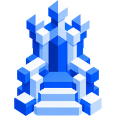
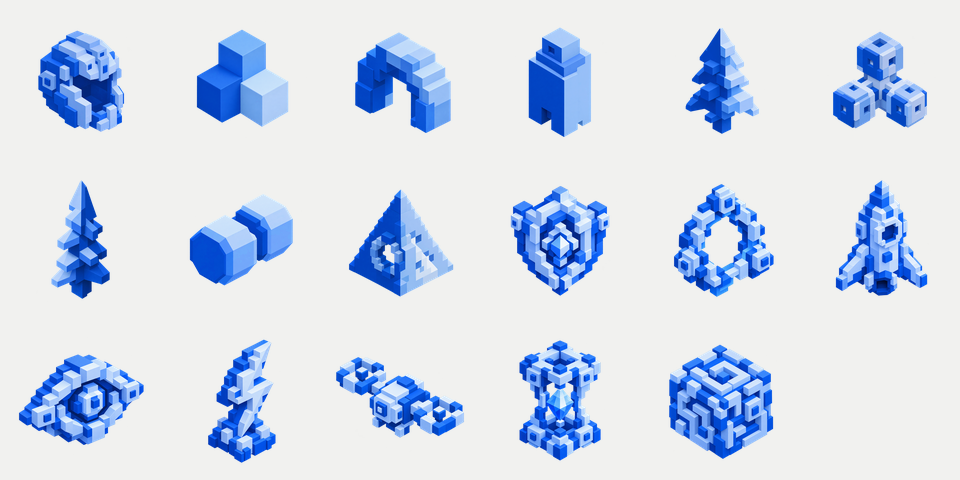

# RULN brand

Logo, token avatars and colours for the community, memes and partners.

## Logo

The throne. Transparent PNG.

| File | Size |
|---|---|
| [`logo/ruln-logo-512.png`](logo/ruln-logo-512.png) | 512 × 512 |
| [`logo/ruln-logo-192.png`](logo/ruln-logo-192.png) | 192 × 192 |
| [`logo/ruln-logo-64.png`](logo/ruln-logo-64.png) | 64 × 64 |

Keep it on light or cobalt backgrounds. Do not recolour, stretch or add effects.

## Colours

| Name | Hex | Use |
|---|---|---|
| Cobalt | `#075FC7` | primary, text, lines |
| Navy | `#0B3568` | dark accents |
| Paper | `#F1F1EF` | background |
| White | `#FFFFFF` | surfaces |
| Green | `#00B778` | live, positive |

## Token avatars

17 voxel symbols, 512 × 512 transparent PNG, in [`avatars/`](avatars). These are the avatars available when launching a token in the app.

`shield` · `portal` · `rocket` · `oracle` · `lightning` · `drone` · `hourglass` · `maze` · `byte` · `nova` · `kai` · `rune` · `zero` · `atom` · `sage` · `flux` · `lynx`

## Usage

Free to use for content about RULN: posts, memes, videos, articles and community art. Do not use the logo to present another project as RULN or to imply an official partnership.

## License

© 2026 RULN. All rights reserved. Use is permitted as described above.
